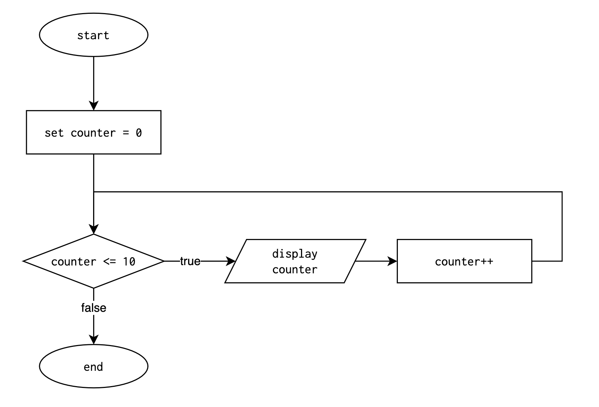

# Lesson: `While` Loops

**Previous Lesson:** [For Loops](https://github.com/SACHSTech/Lesson-For-Loops)

## Why Another Kind of Loop?

`for` loops are great when you know **exactly how many times** something should repeat — like counting from 1 to 10, drawing 20 shapes, or summing a fixed number of inputs.

But not all repetition is predictable.

Some tasks continue until **something happens**:

- Keep asking the user until they enter valid input  
- Keep looping until a correct password is entered  
- Keep simulating until a value reaches a target  

These cases don’t have a fixed number of repetitions. Instead, we stop when a condition becomes false.

This is where the **`while` loop** comes in.

<br>

## What is a `While` Loop?

A `while` loop repeats **as long as** its condition is `true`.

```java
while (condition) {
    // repeated code
}
```

The loop checks the condition **before** each repetition.

If the condition starts false, the loop **may not run at all**.

<br>

## `While` vs `For`: Key Difference

| `for` Loop | `while` Loop |
|-----------|--------------|
| Repeats a **known** number of times | Repeats until a **condition changes** |
| Usually involves a counter | Typically used for validation or waiting |
| Loop structure handles counter & updates | Requires you to *manually* update values |

<br>

## Example 1: Rewriting a `for` Loop as a `while` Loop

```java
int counter = 0;

while (counter <= 10) {
    System.out.println(counter);
    counter++;
}
```

This behaves just like:

```java
for (int counter = 0; counter <= 10; counter++) {
    System.out.println(counter);
}
```

Both the `for` and `while` loop versions can be represented with the same flowchart:




### Infinite Loops (Common Mistake)

If the loop condition never becomes false, the loop runs **forever**.

Example:

```java
int counter = 0;

while (counter <= 10) {
    System.out.println(counter);
    // counter++;   // ← if this is missing...
}
```

The value of `counter` never changes → the condition is **always true** → program never ends.

To avoid infinite loops:
- Make sure something **inside the loop** eventually makes the condition false.

<br>

## Example 2: User Input Validation

```java
double mark = readDouble("Enter a mark (0–100): ");

while (mark < 0 || mark > 100) {
    System.out.println("Invalid input.");
    mark = readDouble("Enter a mark (0–100): ");
}

System.out.println("Thank you!");
```

<br>

## Example 3: Menu Selection

```java
System.out.println("Beverage Menu");
System.out.println("a. Coffee");
System.out.println("b. Bottled Water");
System.out.println("c. Chocolate Milk");

char choice = readChar("Choose a beverage: ");

while (choice != 'a' && choice != 'b' && choice != 'c') {
    System.out.println("Invalid input. Please choose a, b, or c.");
    choice = readChar("Choose a beverage: ");
}

System.out.println("Great choice!");
```

<br>

## Example 4: Repeating Until a Condition Changes

```java
int temp = (int)(Math.random() * 21) + 20; // random 20-40

while (temp <= 30) {
    System.out.println("Temperature: " + temp + "°C");
    temp = (int)(Math.random() * 21) + 20;
}

System.out.println("Warning: Too hot!");
```
<br>

## Choosing Between `for` and `while`

Both `for` and `while` loops can represent the **same logic**, as shown in the flowchart above. So how do you know which one to use?

Think of it as a **design decision**:

| Use a `for` loop when… | Use a `while` loop when… |
|------------------------|-------------------------|
| You know **how many times** the loop should run. | You **do not know** how many repetitions will be needed. |
| The loop is controlled by a **counter**. | The loop is controlled by a **condition that changes** as the program runs. |
| You're iterating through a **sequence** or fixed range. | You're waiting for something to **happen** (input, state change, condition). |

So while it is often possible to represent a loop as one or the other, a programmer can *communicate intent* by picking the most logical structure.

Consider the following examples:

| Scenario | Loop Choice | Reason |
|---------|-------------|-----|
| Print numbers 1–100 | `for` | The number of repetitions is known in advance. |
| Ask the user to enter a grade until they enter one between 0–100 | `while` | We don’t know how many tries the user will need. |
| Draw 30 circles evenly spaced across a line | `for` | The count is fixed (30 circles). |
| Keep simulating temperature readings until the temperature goes above 30°C | `while` | The program depends on a condition, not a fixed count. |

#### Quick Rule of Thumb
- If your thought starts with *“Repeat this X times”*, it's often best to use a **`for`** loop.
- If your thought starts with *“Keep doing this until…”*, it's often best to use a **`while`** loop.

<br>

# Summary

- `while` loops repeat **as long as** their condition is true.  
- Useful when repetition depends on **logic**, not fixed counts.  
- Ensure the loop works toward stopping to avoid infinite loops.

<br>

# Practice Problems — `while` Loops
Complete these using **only** `while` loops. Do not use `for` loops.

### 1. Count Up
Print numbers from 1 to 10.

**Expected Output:**
```
1
2
3
4
5
6
7
8
9
10
```

<br>

### 2. Count Down
Print numbers from 10 down to 1, then print `Blastoff!`.

**Expected Output:**
```
10
9
8
7
6
5
4
3
2
1
Blastoff!
```

<br>

### 3. Repeat a Phrase
Ask the user how many times to print `"Hello"`, then print it that many times.

**Example Run:**
```
How many times? 4
Hello
Hello
Hello
Hello
```

<br>

### 4. Input Validation
Ask the user for a number between 1 and 5.  
Keep asking until they enter a valid number.

**Example Run:**
```
Enter a number (1-5): 9
Invalid input.
Enter a number (1-5): 4
Thank you.
```

<br>

### 5. Password Unlock
Ask the user to enter their password. 
Keep asking until the correct password, `open`, is entered.

**Example Run:**
```
Enter password: fish
Incorrect.
Enter password: banana
Incorrect.
Enter password: open
Unlocked!
```

<br>

### 6. Sum Until Zero
Keep asking the user for integers.  
Stop when they enter `0`.  
Print the total sum.

**Example Run:**
```
Enter a number: 5
Enter a number: -2
Enter a number: 10
Enter a number: 0
Total = 13
```

<br>

### 7. Count the Digits
Ask the user for a positive integer.  
Use a while loop to count how many digits it has. NOTE: There are many ways to solve this problem. Try to implement a pure arithmetic-based solution by repeatedly dividing by 10.

**Example Run:**
```
Enter a number: 43019
Digits: 5
```

<br>

### 8. Multiplication Quiz
Generate two random numbers from 1 to 20.  
Ask the user for the product.  
Repeat until they get it correct.

**Example Run:**
```
What is 7 × 4? 10
Incorrect, try again.
What is 7 × 4? 20
Incorrect, try again.
What is 7 × 4? 28
Correct.
```

<br>

### 9. Collatz Sequence Step Counter (Challenging)

The **Collatz Sequence** is a famous unsolved math problem:

- Start with any positive integer.
- If the number is even, divide it by 2.
- If the number is odd, multiply it by 3 and add 1.
- Repeat until the number becomes 1.

Mathematicians believe it always eventually reaches 1, but no one has proven it for all numbers.

Your task:
- Ask the user for a number.
- Apply the rules in a `while` loop.
- Count how many steps it takes to reach 1.
- Print the step count.

**Example Run:**
```
Enter a number: 6
It took 8 steps to reach 1.
```

<br>

### 10. Right-Aligned Triangle (Challenging)

Ask the user for a number of rows `n`.  
Print a right-aligned triangle of stars.  
Use loops only; do **not** use any string methods.

**Example Run:**
```
How many rows? 5

    *
   **
  ***
 ****
*****
```
